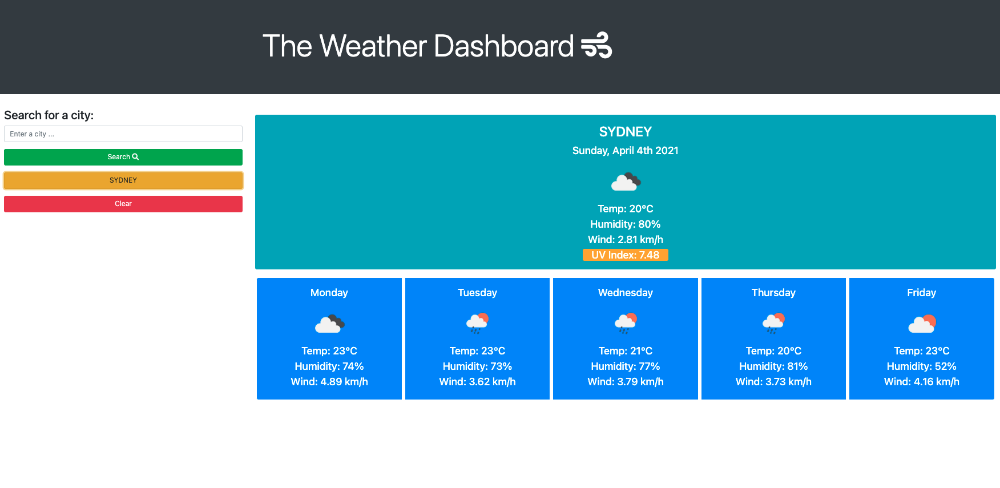
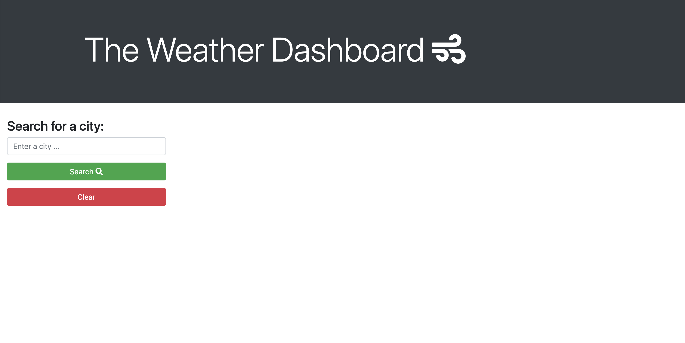

# Weather Dashboard

## Links
### Link to deployed app [here](https://michellewatts20000.github.io/weather-dashboard/)
### Link to the GitHub repo is [here](https://github.com/michellewatts20000/weather-dashboard/)

## Technologies used
HTML, JavaScript, CSS, Bootstrap, JQuery, Open Weather API, FontAwesome and Moment.

## What the app does
Type a city name in the search bar and click search. Once you click 'search' you will see the current weather for that place appear to the right and also the next five days below the current weather.

The data is sourced from Open Weather API. [OpenWeather One Call API](https://openweathermap.org/api/one-call-api)

Your search is then stored as a button below the search button. If you refresh the page your previous searches will still appear below the search button. You can clear your previous search history with the clear button.

## Screenshots

## Contact
Michelle Watts
watts.e.michelle@gmail.com